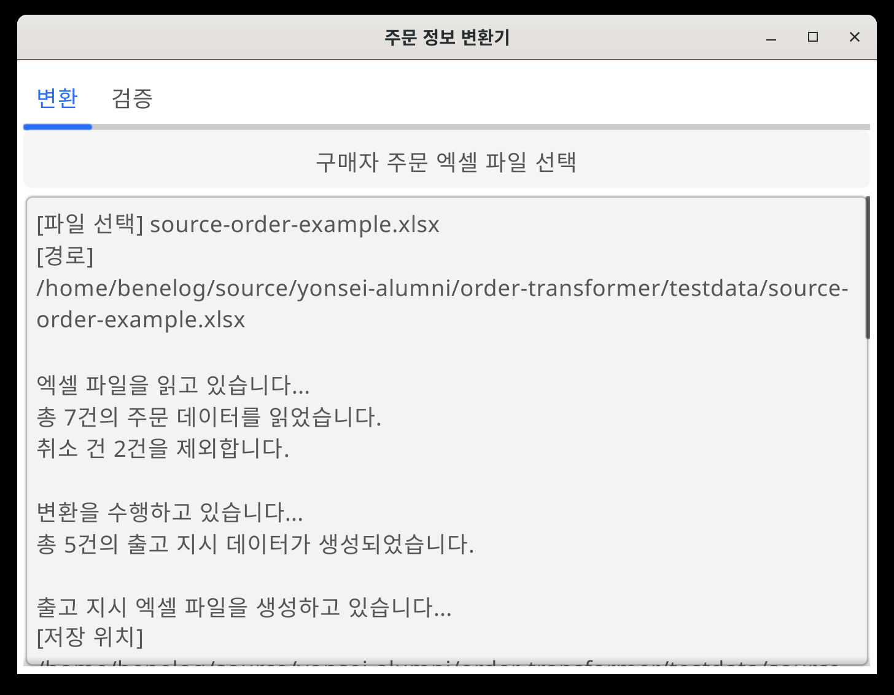

# 주문 정보 변환기

쇼핑몰에서 다운로드한 구매자 주문 엑셀 파일을 3PL 업체 출고 지시용 엑셀 파일로 변환하는 프로그램입니다.

## 기능

### 변환
1. '구매자 주문 엑셀 파일 선택' 버튼을 클릭합니다.
2. 쇼핑몰에서 다운로드한 주문 엑셀 파일(.xlsx)을 선택합니다.
3. 자동으로 변환이 수행되고, 같은 폴더에 `_출고지시_{yyyyMMdd}.xlsx` 파일이 생성됩니다.
4. 변환 완료 후 파일을 바로 열어볼 수 있습니다.
5. 취소된 주문은 자동으로 제외됩니다.

### 검증
1. '구매자 주문 파일 선택' 버튼으로 원본 주문 파일을 선택합니다.
2. '출고 지시 파일 선택' 버튼으로 출고 지시 파일을 선택합니다.
3. '검증' 버튼을 클릭하면 두 파일을 비교 검증합니다.

검증 항목:
- 전체 주문 건수 (취소 건 제외)
- 전체 상품 수량 (취소 건 제외)
- 상품 종류별 수량
- 수령인 정보 누락 여부 (이름, 전화번호, 주소, 우편번호)

## 다운로드

[최신 릴리즈](https://github.com/yonsei-alumni/order-transformer/releases/latest)에서 OS에 맞는 실행 파일을 다운로드하여 실행합니다.

- Windows: `order-transformer-windows-amd64.exe`
- Linux: `order-transformer-linux-amd64`
